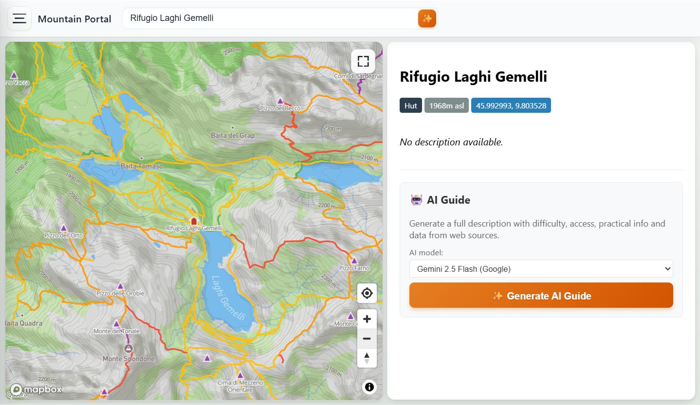
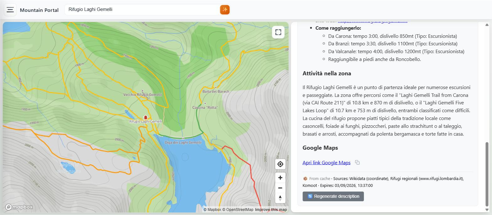
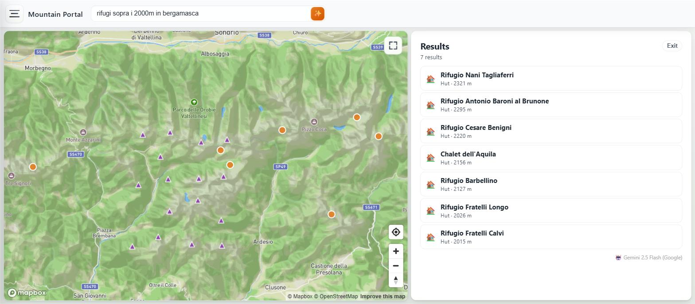
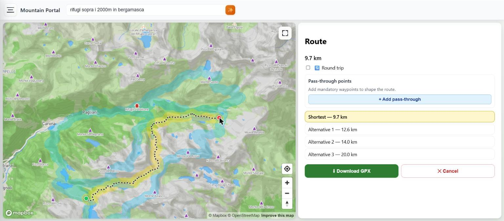
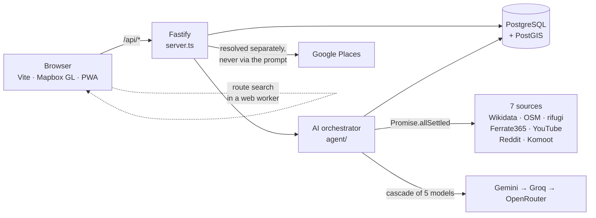

# Mountain Portal

**An interactive map of the Italian Alps that researches a mountain hut for you.**

Huts, bivouacs, peaks and via ferrata on one map — and an AI agent that reads seven sources and
writes you a single briefing on any of them.

[](https://github.com/DaniMeri02/mountain-project/actions/workflows/ci.yml)




## Why

Planning a hut walk in the Bergamo Alps means opening six tabs: OpenStreetMap for where the hut
actually is, a regional *rifugi* site for whether it is staffed, Komoot for what the approach is
like, Reddit and YouTube for whether anyone has been up there recently, and Google Maps to check
the thing exists at all. The facts are public; they are just scattered.

This portal puts the map and the research in one place. Pick a hut, and an AI agent queries all of
those sources in parallel and writes one Italian briefing: access, difficulty, timing, what to
expect in summer versus winter.

## Features

**AI research agent** — one click on a POI runs seven sources concurrently (Wikidata, Overpass,
regional *rifugi* sites, Ferrate365, YouTube, Reddit, Komoot) and feeds the result to a five-model
cascade across three providers. A dead source degrades the briefing; it never blocks it. Results
are cached in Postgres for 48 hours.



**Smart search in plain language** — type *"rifugi sopra i 2000m in bergamasca"* and get a result
list plus map markers. The model never writes SQL: it emits a constrained JSON filter the backend
validates field by field and compiles into a parameterized PostGIS query.



**Verified Google Maps links** — for huts and bivouacs, resolved server-side against the Places
API and only shown after clearing four gates (place type, 300 m radius, building-kind contradiction,
name-token match). A verified absence says so out loud; a failed lookup shows nothing at all.

**Route finder** — click a start and an end and a Dijkstra search over the trail graph runs in a
web worker, offering alternatives, optional via points, round trips and GPX export.



**Offline mode** — save a bounding box and its trails, POIs, ferrata and map tiles download for the
mountains, where there is no signal. Overlays live in IndexedDB; tiles are ref-counted in the
service-worker cache, so deleting one area only evicts tiles no other area still needs.

**Five basemaps** — Mapbox Outdoors, satellite 2D, satellite 3D (terrain + sky), OpenStreetMap and
OpenTopoMap. Installable as a PWA.

## Architecture



```
server.ts            Fastify entry point, every route
db.ts                one createPool()
agent/               AI orchestrator, model cascade, sources, smart-search filter
src/                 frontend TypeScript — map, panels, search, routing/, offline/
public/              static assets + the committed POI dataset
ai-agent-conf/       editable Markdown prompts, no restart needed
scripts/             migrations, Overpass importers, deploy provisioning
tests/               vitest suites + Playwright e2e
```

## Quickstart

Needs Node 22, PostgreSQL with PostGIS, and a free Mapbox token.

```bash
git clone https://github.com/DaniMeri02/mountain-project.git
cd mountain-project
npm ci

cp .env.example .env        # add MAPBOX_TOKEN + at least one AI key

npm run migrate:ai          # create the cache tables
npm run migrate:search
npm run migrate:places
npm run import:areas        # administrative boundaries
npm run import:pois         # the committed POI dataset

npm run dev                 # → http://localhost:5173
```

Full setup, every environment variable and the script reference are in
**[docs/DEVELOPMENT.md](docs/DEVELOPMENT.md)**.

## Two decisions worth reading

**The LLM emits validated JSON, never SQL.** Smart search could have let the model write SQL against
a read-only role. It writes a `SearchFilter` instead — every field checked against an allow-list,
every user-derived value a bound parameter. A prompt injection can at worst produce a filter that
returns the wrong huts. → [ADR-0001](docs/adr/0001-structured-filter-json.md)

**The Maps link never passes through the prompt.** No model in the cascade can browse, so any URL an
LLM writes is invented. The Google Places lookup runs server-side, in parallel with the sources, and
its result is appended to the finished description. It has three outcomes, and the difference
matters: a verified link, a verified absence, or — when the key is missing, the call throttled or
the network down — nothing at all. Silence is not evidence of absence.

## A note on language

The interface is in English; everything the AI *generates* is in Italian, headings included. That is
deliberate. The sources are Italian, the mountains are Italian, and the briefing should read in the
same language as the trail signs. See [CONTEXT.md](CONTEXT.md) for the full domain glossary.

## Documentation

| Document | For |
|---|---|
| [docs/DEVELOPMENT.md](docs/DEVELOPMENT.md) | Setup, scripts, database, API, deploy |
| [CONTEXT.md](CONTEXT.md) | Domain glossary — the vocabulary the code uses |
| [docs/adr/](docs/adr/) | Architecture decision records |
| [CLAUDE.md](CLAUDE.md) | How an AI coding agent should read this repo |

## Status

A personal project, built to learn TypeScript in anger. It runs on a mini-pc on my desk, deployed by
GitHub Actions to a prebuilt `deploy` branch. There is no authentication — it was never meant to be
multi-tenant. Facebook and TripAdvisor sources are written but disabled (Apify credits).

Data © OpenStreetMap contributors, [ODbL](https://www.openstreetmap.org/copyright). Administrative
boundaries from [openpolis/geojson-italy](https://github.com/openpolis/geojson-italy).

## License

[MIT](LICENSE) © 2026 DaniMeri
